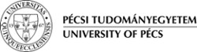
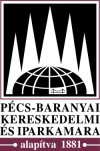
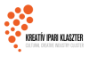
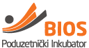
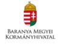
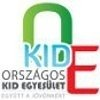

The __Humán Innovációs Csoport Non-profit Ltd.__ is a social enterprise operating since 2009. It combines reaching _high priority community goals_ with successful _business
operation_ that enables a long-run, both financially and professionally sustainable
business model.

__Our social mission:__
- Supporting a successful course of life by trainings for developing skills and competences
- Reintegration of socially handicapped people and groups
- Complex regional development (both socially and economically)
- Supporting the set up and development of social enterprises, CSR

We generate and develop a large number of professional __programs and projects__,
mainly _cooperating with other organizations_, but we also execute a number of _own
projects_.

__Professional services:__
- Regional development
- Enterprise development
- Organization development
- Community development
- Trainings (leadership, labour market, personal skills and competences)
- Adult education (we are an accredited adult education centre)
- Coaching
- Tender expert services
- CSR development and counselling

__Operational principles:__

- Extensive cooperation with partners
- Teamwork
- Transparency
- Constant development based on self-evaluation
- Creativity and innovation
- Constant service development
- Responsible operation in our narrow and wide environment
- Involving the employees in decision-making and leading
- Family friendly working place

__Strategic Partners:__

- The University of Pécs

- The Chamber of Industry and Commerce of Pécs, Baranya

- IFKA

- Creative Industry Cluster

- Coach Centre

- BIOS Incubator House in Eszék

- Maltese Charity Service

- Government Office of Baranya

- Country KID Association

- Enterprises

- Local Governments
