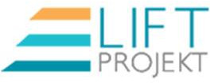

Every organization needs to be balanced, because this guarantees the optimal
business operation. Balance on the other hand can also mean constancy that can be
an obstacle to development. This balance can tip out in case of development that
needs immediate action. This is the moment when we can enter and help to find
the obstacles, form the new strategy together, make an action plan and its
execution.

## __LIFT complex enterprise development programme__

__Our goal__ is to give long-run and effective solutions for companies that would like to
reach high performance, be successful on the quickly changing market, and aim at
a progressive development with the help of the motivated employees.
Our mission is to be part of the development of organizations, where the
employees cooperate effectively, motivatedly and advisedly. We help to establish
working places, where the employees are energetic, health conscious and find
satisfaction in their work that enables them to be a strong team with continuous
high performance. These goals have an influence on the individual, the family, the
organization, the micro and macro environment. We support the establishment of
working places, where people enjoy to work; we also would like to call people´s
attention to the importance of preserving health. We believe that health
preservation and the health-conscious attitude has a huge influence on the society
and also on the businesses. It is very important that healthy people work in a
healthy organization, which is the key for efficiency. This improves the
commitment between the employer and the employee, reduces fluctuation and
missing working days.

__Short description__

LIFT is a complex service for small and medium enterprises that combines
organization, health and individual development. Our goal is to provide effective
solutions for enterprises that would like to reach high efficiency and dynamic

development with motivated, health conscious and goal oriented employees. We
are unique on the market with combining all three areas in one programme.

__The procedure__

It includes the diagnosis, the individual, group and organizational development,
the feedback and the coaching. The procedure is horizontally accompanied by the
involvement of the colleagues to achieve commitment. We don´t use the same
model in every project, we always deal with the businesses and the problems
individually. In every case we make a diagnosis about the organization first, then
we make a programme for development fit for the given enterprise concerning the
existing problems. Our aim is to reach a learning organization committed to the
common goal with the involvement of the motivated employees.
