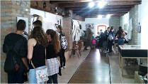

__“Jaszam tike!”__, a local history exhibition opened its gates on the 18 th of April, _2015_
to commemorate the Bosnian minority in Szigetvár.
The location __-the Barn-__ was originally built for agricultural purposes 19 th c. It lost
its function in the 20 th century, but it was reopened as a cultural centre in 2015.
The beamed ceiling preserves the original building characteristics, the heating is
provided with gas-based floor heating.

__The purpose of the exhibition__ is to show the ethnical local history of Szigetvár
between the 17 th and 20 th centuries through the culture of the local southern Slav
peasants.
There is an event room on the ground floor and a museum on the first floor of the
freshly renovated building. The whole building is approximately __180 sqm__ big, the
museum is __50__. There is a long stairway leading up to the museum area, but there is
also an elevator for barrier-free approach. The building also has a renovated attic
that has not yet found its purpose. There is an entrance area before entering the
exhibition area. It currently functions as a reception, where people buy their
tickets, but it could also function as a cloak-room. The rest rooms are on a side
corridor opening from the exhibition area.

The primary goal of the thematically
organized exhibition is to show the material and spiritual culture of the local
Bosnian peasants. In the same time it also commemorates the orthodox Serbian
inhabitants of Szigetvár. The different themes are represented with photos and
info boards on the wall, cabinets filled with exhibition objects and there are also
digital frames with archive photos being continuously displayed.
The exhibition objects on display are all authentic, everyday agricultural
household objects.

There was an ethnic group that found a new home in the eastern part of Szigetvár
after fleeing from the catholic Croatian side of Bosnia in the Turkish times. This
part of Szigetvár still keeps the memory of these people with its Balkan-style
alleys; the locals still call this area Gornyamála. The Bosnians of Szigetvár were

farmers; they cultivated land and kept animals. In the 18th c. half of Szigetvár´s
population was Bosnian, by the end of the 19 th c. most of them became Hungarian,
but they still kept their traditions that distinguished them from the rest of the
citizens. Since they lived in the same place, many of them had the same names, so
they found nicknames to distinguish between the families, many of which still exist
today. They were deeply religious Catholics, their traditions and festivals
contributed a lot to the richness of Szigetvár´s ethnology. During the changes of the
second half of the last century the Bosnian culture and traditions have
disappeared, their thatched roofed, stemmed houses were demolished, only the
knowledge remained that their ancestors were the earliest inhabitants of
Szigetvár.

The Circle of Friends of the Castle of Szigetvár took the initiative to rescue and save
everything that remains from this Bosnian heritage, the Bosnians of Szigetvár have
to be commemorated, because their descendants still live among us. So they have
collected all existing household objects, written and material relics to show this
rich heritage at a permanent exhibition.
